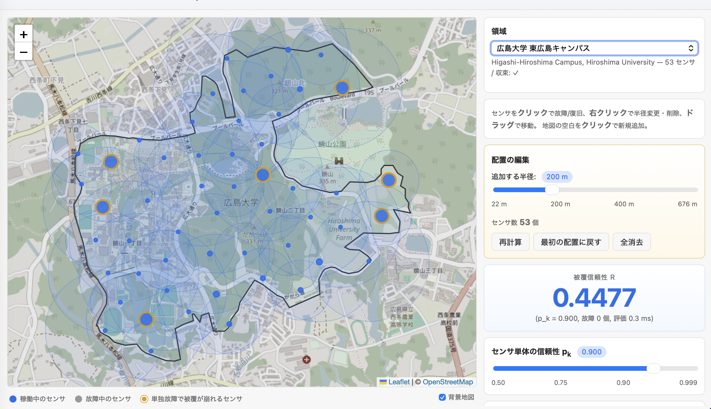

# 被覆信頼性デモ Web アプリ

論文 IEEE Transactions on Reliability 投稿
*Symbolic Reliability Evaluation of Probabilistic Geometric Coverage Using Binary Decision Diagrams*
§VI のケーススタディをブラウザで触れるデモアプリ。
研究室紹介・オープンキャンパス・公開講座などでの利用を想定しています。



## できること

- 広島大学東広島キャンパス・霞キャンパス・広島城周辺の3領域から選択
- 地図上のセンサ円とその被覆を OSM 背景に重ねて可視化
- センサ単体故障率 $p_k$ をスライダで連続変更（R が µs オーダで更新）
- センサを **クリックで故障/復旧**、その瞬間の重要度ランキングと致命的センサ集合が動的に再計算される
- 最小カット集合（被覆崩壊の引き金）・最小パス集合（必要十分な部分集合）をワンクリックで再現
- センサを **ドラッグで移動 / 空白を Ctrl+クリック（Mac は ⌘+クリック）で追加 / 右クリックで半径変更・削除** することで配置を編集し、「再計算」で 100〜300 ms 程度で新しい BDD を組み直し

## 起動方法

会場ノート PC での想定。Docker Desktop を起動した状態で `webapp/` ディレクトリで:

```bash
docker compose up -d --build
# ブラウザで http://localhost:8080 を開く
```

初回ビルドは MiniCUDD のソースビルド込みで 10〜15 分。
ビルド済みイメージは `docker compose up -d` だけで数秒で起動します。

停止:

```bash
docker compose down
```

## 画面の使い方

### サイドパネル (上から順)

| カード | 役割 |
|---|---|
| 領域 | プリセット 3 領域から選択 |
| チートシート | 操作ジェスチャの早見表 |
| 配置の編集 | 追加時の半径スライダ、センサ数表示、「再計算」「最初の配置に戻す」「全消去」ボタン |
| 被覆信頼性 R | 現在の R 値、計算時間 |
| $p_k$ スライダ | 0.50–0.999 で連続変更 |
| 故障シナリオ | 故障中のセンサ一覧、「最小カットを試す」「最小パスを試す」 |
| Birnbaum 重要度 | 現在の状態での重要度トップ 10 |

### 地図上の操作

| ジェスチャ | 結果 |
|---|---|
| センサをクリック | 故障/復旧トグル |
| センサを右クリック | ポップアップ表示（半径スライダ・削除） |
| センサをドラッグ | 位置移動 |
| 地図の空白を Ctrl+クリック（Mac は ⌘+クリック） | 新規センサ追加（半径は側パネル設定）。素のクリックは故障トグル専用なので誤追加防止のため修飾キーを要求 |
| 地図凡例の「背景地図」チェック | OSM タイル ON/OFF（センサ円だけ見たい時用） |

### 配置を変更したとき

センサを移動・追加・削除・半径変更すると、サイドパネル下部の評価カード群（R、$p_k$、故障シナリオ、重要度）が **薄く操作不可** になります。これは「いま表示中の値は古い BDD のもの」を示すサインで、編集カードの「再計算」ボタンが赤く強調されます。再計算（または「最初の配置に戻す」）で評価カードが復活します。

## 領域プリセットの追加

新しい領域を追加するには:

1. [Overpass Turbo](https://overpass-turbo.eu) で領域の way / relation を `out geom;` で取得し、`webapp/presets/_inputs/<id>.raw.json` に保存
2. コンテナ内でビルドスクリプトを実行:

```bash
docker exec pgcp-webapp julia /app/webapp/scripts/build_preset.jl \
    /app/webapp/presets/_inputs/<id>.raw.json \
    <id> "<日本語表示名>" "<English subtitle>"
```

スクリプトが PDS でセンサ配置、CDT、BDD 求解、重要度・min-cut/path 計算までを行い、5 個の JSON を `webapp/presets/<id>/` に出力します。

3. コンテナ内で生成された preset をホストにコピーしてリビルド:

```bash
docker cp pgcp-webapp:/app/webapp/presets/<id> webapp/presets/
docker compose up -d --build
```

## アーキテクチャ概要

```
ブラウザ (Leaflet.js + 素の JS)
     │  HTTP / JSON
     ▼
Julia バックエンド (Oxygen.jl, port 8080)
  ├─ 起動時: 各プリセットを求解しメモリに常駐 (Manager + 収束 BDD)
  ├─ GET  /api/regions           領域一覧
  ├─ GET  /api/regions/{id}      ポリゴン・センサ・メッシュ・事前解析
  ├─ POST /api/regions/{id}/evaluate   {pk, disabled[]} → {R, importance}
  └─ POST /api/regions/{id}/replan     {sensors[]} → 再 CDT + 再求解 + 再解析
```

- BDD 評価 (`prob`) は memoized DAG 走査、µs オーダ
- 配置編集の再計算は in-process で完結（CDT は `DelaunayTriangulation.jl`、BDD は `MiniCUDD.jl`、解析は `BDDAnalysis` モジュール）
- Docker イメージは `julia:1.10` から直接構築。MiniCUDD は git からビルド、その他は General レジストリ

## ディレクトリ構成

```
webapp/
├── Dockerfile               # julia:1.10 ベース + MiniCUDD + Oxygen
├── docker-compose.yml
├── server/
│   ├── Project.toml         # Oxygen, JSON3, HTTP, GeometryBasics, ProgressMeter
│   ├── server.jl            # エントリ・ルーティング
│   ├── regions.jl           # RegionState・load/eval/replan
│   ├── triangulation.jl     # DelaunayTriangulation.jl ラッパ
│   ├── bdd_solver_triangle.jl  # ソルバ (vendored from pgcp-experiments)
│   └── bdd_analysis.jl         # 重要度/最小集合 (vendored from pgcp-experiments)
├── static/
│   ├── index.html
│   ├── app.js
│   └── style.css
├── presets/                 # 事前計算済みデータ (リポジトリにコミット)
│   ├── higashi_hiroshima/
│   ├── kasumi/
│   ├── castle/
│   └── _inputs/             # Overpass 生 JSON (ビルド用)
└── scripts/
    ├── build_higashi_hiroshima.py  # 既存 experiment5 成果物の取り込み (Python)
    ├── build_preset.jl             # 新規領域 Julia ビルドパイプライン
    └── sync_solver.sh              # pgcp-experiments/ の更新を vendored copy へ同期
```

`bdd_solver_triangle.jl` と `bdd_analysis.jl` は `pgcp-experiments/scripts/` のソルバ・アナリシスをそのままコピーしたものです（リポジトリ単体配布のため）。上流が更新されたら `scripts/sync_solver.sh` を実行してください。

## 既知の制限と運用上の注意

### 並行アクセス

- **スライダ・故障トグルは何人でも同時利用可**: `/evaluate` はステートレスで、`pk` と `disabled[]` がクライアント側 JS に保持されるので、複数の来場者が同じ URL を別々に開いても干渉しません
- **配置編集はサーバ共有**: `/replan` はサーバ側の `RegionState` を上書きします。1 人が「再計算」を押すと他の閲覧者の BDD も差し替わります。会場運用としては「1 オペレータ + 多数閲覧者」モデルを想定してください。各人独立の編集セッションが必要な場合は session/room 機能の追加が必要です

### スレッド安全性

- CUDD / MiniCUDD は **スレッドアンセーフ** です（read 系の `birnbaum` / `minsol` も内部で BDD ノードを割当するため真の read-only ではない）
- 本サーバは region ごとに `ReentrantLock` を持ち、`/evaluate` と `/replan` の本体を必ず lock 下で実行することで Manager の整合性を保証しています
- そのため Julia を `--threads=N` で起動しても安全ですが、同一 region へのリクエストはシリアル化されます。`birnbaum` 計算が µs〜数 ms オーダなので体感上の問題はありません
- 別 region への並列リクエストは独立した lock なので真に並列実行されます

### メモリ・性能

- 配置編集モードで CUDD Manager は 1 個常駐し、replan のたびに新規 Manager が確保されます。Julia GC により旧 Manager は徐々に解放されますが、長時間運用後にメモリが気になる場合は `docker restart pgcp-webapp` でリセット
- 配置編集時のセンサ数が 100 を大きく超えると BDD 求解時間が無視できなくなります。デモでは 80 個程度を目安に
- min-path セットは `enum_limit = 200_000` で打ち切ります（count_solutions が exact なので、200,000 を超えるとフロントの「最小パスを試す」は smallest だけを使う形になります）

### UI / 入力

- OSM タイルはネットワーク取得です。会場 Wi-Fi 不安定時のために、「背景地図」チェックで OFF にできるようにしています
- ポリゴン外をクリックしても新規センサは追加されません（bbox チェック済み）
- 右クリックで開くポップアップ内のクリックはマップに伝播しないようガード済み。万一誤って空白クリック扱いになっても `.leaflet-interactive` 判定で再防御しています

## 関連ドキュメント

- 親リポジトリの `CLAUDE.md` — 論文構成と既存実験の文脈
- `pgcp-experiments/experiment5/REPRODUCIBILITY.md` — 東広島キャンパスケーススタディの数値再現手順
- `manuscript/main.tex` §VI — 案内されているケーススタディの正準説明
